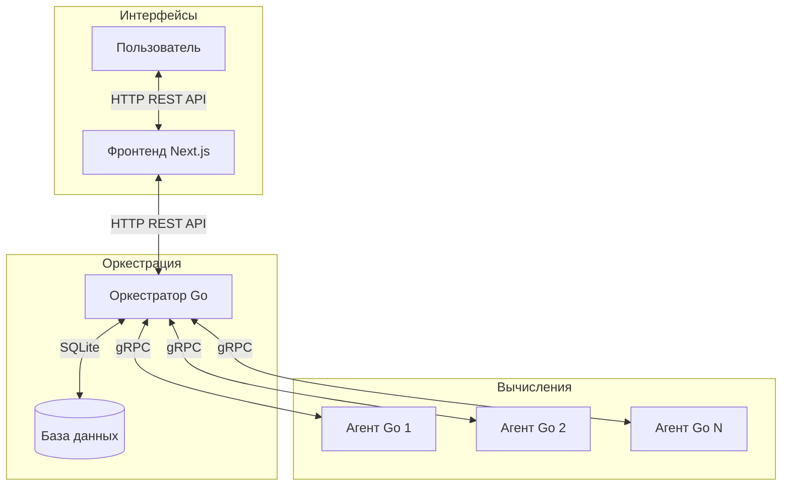

# сalc-yandex-go

Cервис на Go для вычисления арифметических выражений. Сервис принимает математические выражения через POST-запросы и возвращает вычисленные результаты с использованием распределенной архитектуры.

## Функциональность

- Асинхронное вычисление арифметических выражений
- Поддержка базовых арифметических операций (+, -, *, /)
- Поддержка скобок для управления порядком операций
- Формат обмена данными JSON для HTTP API
- gRPC для высокопроизводительной коммуникации между компонентами
- Распределённое выполнение операций между агентами
- История вычислений с подробной информацией
- Аутентификация пользователей
- Веб-интерфейс для удобного использования
- Обработка ошибок с соответствующими HTTP-кодами

## Архитектура



## Установка и запуск

### Предварительные требования

- Установленный Go (версия 1.20 или выше)
- Node.js 18+ и npm (для фронтенда)
- Docker и Docker Compose (для запуска через Docker)
- Make (опционально, для упрощения запуска)

### Запуск через Make
Для удобства запуска всех компонентов системы используйте команды Make:

```bash
# Клонирование репозитория
git clone https://github.com/neptship/calc-yandex-go
cd calc-yandex-go

# Установка всех зависимостей (Go модулей и npm пакетов)
make install

# Запуск всех компонентов (оркестратор, агенты, фронтенд)
make run-all
```

### Запуск через Docker
Проект поддерживает запуск через Docker и Docker Compose:

```bash
git clone https://github.com/neptship/calc-yandex-go
cd calc-yandex-go
docker-compose up
```

### Ручной запуск

**Клонирование репозитория и установка зависимостей**

```bash
# Клонирование репозитория
git clone https://github.com/neptship/calc-yandex-go
cd calc-yandex-go

# Установка Go модулей
go mod tidy

# Установка npm пакетов
cd frontend
npm install
cd ..
```

**Запуск оркестратора**
```bash
go run cmd/orchestrator/main.go
```

**Запуск агентов (В отдельном терминале)**

```bash
go run cmd/agent/main.go
```

По умолчанию оркестратор запускается на порту 8080 для HTTP и 8090 для gRPC.

### Запуск фронтенда

```bash
cd frontend
npm run dev
```

Веб-интерфейс будет доступен по адресу: http://localhost:3000


## REST API Спецификация

### Аутентификация

#### POST /api/v1/register
Регистрация нового пользователя.

**Формат запроса:**
```json
{
    "username": "user1",
    "password": "password123"
}
```

**Успешный ответ (201 Created):**
```json
{
    "message": "User registered successfully"
}
```

#### POST /api/v1/login
Вход в систему.

**Формат запроса:**
```json
{
    "username": "user1",
    "password": "password123"
}
```

**Успешный ответ (200 OK):**
```json
{
    "token": "eyJhbGciOiJIUzI1NiIsInR5cCI6IkpXVCJ9..."
}
```

### Вычисления

#### POST /api/v1/calculate

Отправляет выражение на вычисление и возвращает идентификатор задачи.

**Формат запроса:**
```json
{
    "expression": "2+2*2"
}
```

**Успешный ответ (201 Created):**
```json
{
    "id": 1
}
```

**Ответ при некорректном выражении (422 Unprocessable Entity):**
```json
{
    "error": "invalid expression"
}
```

**Ответ при внутренней ошибке сервера (500 Internal Server Error):**
```json
{
    "error": "internal server error"
}
```

#### GET /api/v1/expressions/:id

Получает статус и результат вычисления по идентификатору.

**Успешный ответ (200 OK), вычисление завершено:**

```json
{
    "expression": {
        "id": 1,
        "status": "completed",
        "result": 6
    }
}
```

**Успешный ответ (200 OK), вычисление в процессе:**

```json
{
    "expression": {
        "id": 1,
        "status": "processing"
    }
}
```

**Выражение не найдено (404 Not Found):**

```json
{
    "error": "Expression not found"
}
```

#### GET /api/v1/expressions

Получает список всех выражений и их статусов.

**Успешный ответ (200 OK):**

```json
{
    "expressions": [
        {
            "id": 1,
            "status": "completed",
            "result": 6
        },
        {
            "id": 2,
            "status": "processing"
        }
    ]
}
```

## Примеры использования

### Регистрация и авторизация

**Регистрация нового пользователя:**
```bash
curl --location 'http://localhost:8080/register' \
--header 'Content-Type: application/json' \
--data '{
    "username": "test_user",
    "password": "password123"
}'
```

**Авторизация:**
```bash
curl --location 'http://localhost:8080/login' \
--header 'Content-Type: application/json' \
--data '{
    "username": "test_user",
    "password": "password123"
}'
```

### Успешные сценарии вычислений

**Отправка выражения на вычисление:**
```bash
curl --location 'http://localhost:8080/api/v1/calculate' \
--header 'Content-Type: application/json' \
--header 'Authorization: Bearer JWT_TOKEN' \
--data '{
    "expression": "2+2*2"
}'
```

Ответ:
```json
{
    "id": 1
}
```

**Отправка сложного выражения:**
```bash
curl --location 'http://localhost:8080/api/v1/calculate' \
--header 'Content-Type: application/json' \
--header 'Authorization: Bearer JWT_TOKEN' \
--data '{
    "expression": "(70/7) * 10 /((3+2) * (3+7)) - 2"
}'
```

Ответ:
```json
{
    "id": 2
}
```

**Получение результата вычисления:**
```bash
curl --location 'http://localhost:8080/api/v1/expressions/1' \
--header 'Authorization: Bearer JWT_TOKEN'
```

Ответ:
```json
{
    "expression": {
        "id": 1,
        "status": "completed",
        "result": 6
    }
}
```

**Получение списка всех выражений:**
```bash
curl --location 'http://localhost:8080/api/v1/expressions' \
--header 'Authorization: Bearer JWT_TOKEN'
```

Ответ:
```json
{
    "expressions": [
        {
            "id": 1,
            "status": "completed",
            "result": 6
        },
        {
            "id": 2,
            "status": "processing"
        }
    ]
}
```

### Обработка ошибок

**Невалидный JSON при отправке выражения:**
```bash
curl --location 'http://localhost:8080/api/v1/calculate' \
--header 'Content-Type: application/json' \
--header 'Authorization: Bearer JWT_TOKEN' \
--data 'not-valid-json'
```

Ответ:
```json
{
    "error": "Invalid request format"
}
```

**Некорректное выражение:**
```bash
curl --location 'http://localhost:8080/api/v1/calculate' \
--header 'Content-Type: application/json' \
--header 'Authorization: Bearer JWT_TOKEN' \
--data '{
    "expression": "2+*2"
}'
```

Ответ:
```json
{
    "error": "invalid expression"
}
```

**Запрос несуществующего выражения:**
```bash
curl --location 'http://localhost:8080/api/v1/expressions/999' \
--header 'Authorization: Bearer JWT_TOKEN'
```

Ответ:
```json
{
    "error": "Expression not found"
}
```

**Деление на ноль:**
```bash
curl --location 'http://localhost:8080/api/v1/calculate' \
--header 'Content-Type: application/json' \
--header 'Authorization: Bearer JWT_TOKEN' \
--data '{
    "expression": "5/0"
}'
```

После проверки статуса выражения:
```json
{
    "expression": {
        "id": 3,
        "status": "failed",
        "result": null
    }
}
```

## Ограничения

- Поддерживаются только положительные целые и десятичные числа
- Использование унарного минуса или плюса может привести к некорректной работе
- Все нестандартные символы в выражении (буквы, спецсимволы) приведут к ошибке 422
- Для доступа к API необходимо указывать JWT-токен

## Запуск тестов

```bash
# Запуск всех тестов
cd calc-yandex-go
make test

# или напрямую
go test ./... -v

# Запуск тестов для конкретного пакета
go test ./internal/orchestrator -v
```